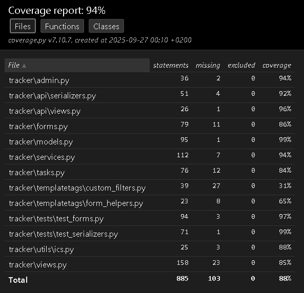

# MoodLinker: IU International University of Applied Sciences Tracker App Portfolio Project


## Description

**MoodLinker** is an emotion-driven habit tracker built with Django, Bootstrap 5, and AI-Powered analytics. It helps users develop and maintain **five key daily habits** while logging their mood and refections. The app correlates with habit completion, offering insights, streak tracking, and emotion-aware reminders.

Think of it as a **blend of therapy**, **habit-building**, and **smart analytics** in a sleek, engaging interface.

## Features

- **Habit Tracking** — Track up to **five daily habits** with completion states.
- **Mood Logging** — Record mood scores (1-5) with reflections and emojis.
- **Analytics Dashboard** — View mood-habit correlations with **Chart.js** graphs.
- **Smart Notifications** — Celery + Redis handle reminders when motivation dips.
- **Calendar Integration** — Export reminders to your calendar with ICS feeds.
- **AI Suggestion** — NLP-powered insights (spaCy + VADER) provide tips like _"Your motivation dips on Sundays—plan lightr habits."_
- **Authentication** — Secure user registration, login, and personalized profiles.
- **Timezone Aware** — Reminders and notifications respect user's local timezone.


## Tech Stack

- **Backend:** Django 5+, Django REST Framework
- **Frontend:** Bootstrap 5. Chart.js, Vanilla JavaScript, CSS
- **Database:** MySQL (default, can use SQLite for testing)
- **Task Queue:** Celery + Redis
- **AI/NLP:** spaCy, NLTK, VADER sentiment analysis
- **Testing:** pytest, pytest-django


## Installation

Follow these steps to set up MoodLinker locally.

### 1. Clone the Repository

```bash
git clone https://github.com/CyrilCele/moodlinker.git
```

### 2. Set Up Python Environment

Using **Pipenv** (recommended):

```bash
pip install pipenv
pipenv install --dev
pipenv shell
```

Or with **requirements.txt**:

```bash
python -m venv venv
source venv/bin/activate    # On Windows: venv\Scripts\activate
pip install -r requirements.txt
```

### 3. Configure Database

Update your `settings.py` for MySQL (or fallback to SQLite).
Applying migrations:

```bash
python manage.py makemigrations
python manage.py migrate
```

### 4. Create Superuser

```bash
python manage.py createsuperuser
```

### 5. Run Redis (for background tasks)

Make sure Redis is installed and running:

```bash
redis-server
```

### 6. Start Celery Worker

```bash
celery -A moodlinker worker -l info
celery -A moodlnker beat -l info    # for scheduled tasks
```

### 7. Run Django Server

```bash
python manage.py runserver
```

Now visit: http://127.0.0.1:8000

## Usage

1. **Register/Login** to create your profile.
2. **Add up to 5 habits** (daily/weekly/monthly).
3. **Log your mood** daily with a reflection.
4. **Mark habits as complete** each day.
5. **View analytics** for correlations and streaks.
6. **Enable reminders** to get notified when motivation drops.
7. **Export calendar** reminders via ICS feed.

## Demo Data

You can preload the app with **4 weeks of demo habits, mood entries, and completions**. This is useful for showing streak tracking, analytics, and persistence in action.

Run the management command:

```bash
python manage.py load_demo_data --user admin --file tracker/fixtures/demo_seed.json
```

#### What it doess:

- Seeds **5 predefined habits** (at least 1 daily + 1 weekly).
- Inserts **28 days (4 weeks)** of mood entries and habit completion patterns.
- Runs built-in analytics (list habits, streaks, correctness checks).
- Demonstrates a **persistence round-trip**: load → modify → save → reload.
- Ensures you have data ready to showcase the analytics dashboard immediately.
  > ⚠️ Make sure the user (`--user`) exists before running. For example, the username I chose is `admin`, but any username of your choice will suffice. Just remember not to put `admin` if your username is different to mine.

## Testing

Run unit and integration tests with

```bash
pytest
```


## Test Coverage

To generate a **coverage report** in HTML format (see which lines are covered):

```bash
pytest --cov=tracker --cov-report=html
```

This will create an `html/` folder. <br>
Open `htmlcov/index.html` in your browser to view the interactive coverage report.



#### Current Coverage Snapshot

- **Overall Coverage**: 94%
- **Highlights**:
  - `tracker/models.py` - 99% (covers model constraints and strings reprs)
  - `tracker/services.py` - 94% (covers streaks, summaries, AI suggestions)
  - `tracker/tests/test_forms.py` - 97%
  - `tracker/tests/test_serializers.py` - 99%
  - Lower coverage: template filters/helpers (~30-65%)

#### Test Coverage Mapping

The following unit/integration tests cover key app functionality:

- **Habit CRUD (Create/Edit/Delete):**
  - `tests_forms.py` - ensures form validation (habit name uniqueness, 5-habit cap).
  - `test_serializers.py` - validates API serializers for habit create/update.
  - `views.py` tests - exercise Django views for habit creation and deletion.
- **Mood CRUD:**
  - `test_forms.py` - validates mood entry form (unique per day).
  - `test_serializers.py` - covers serializer rules for moods.
- **Analytics Functions (`tracker/services.py`):**
  - `AnalyticsService.longest_streak()` - tested via habit completion sequences.
  - `AnalyuticsService.summaries()`: - tested across daily/weekly/monthly views.
  - `AISuggestionService.analyze_reflection()` - sentiment scoring tested with positive/negative/neutral text.
    `AISuggestionService.suggest()` - end-to-end coverage using seeded mood entries and reflections.
- **Management Command (Demo Data):**
  - `load_demo_data` tested indirectly by verifying seeded habits, moods, and completions exist after command execution.
- **Notes**:
  - Areas needing improvement: template tag filters (`custom_filters.py`, `form_helpers.py`) currently have limited test coverage.
  - Business-critical logic (models, services, analytics, API) is nearly fully covered.

## Project Structure


## Author

Nkululeko Cyril Cele
